  
  
  
  

### 👋 This is Wankko Ree!
##### a undergraduate majoring in Network Engineering.

---

### 🔧 ~~Full Stack Developer~~ 啥也不会

*所有技能点皆为`Lv.1`*

会一点前端，会一点后端，会一点算法，会一点UI

---

### 个人项目

#### 开源软件

#### 随写练手

#### 特定需求

